### Verifying Claims in the Paper

After generating `results/`, we explain how to reproduce the figures, tables, and conclusions reported in the paper.

> **Note:** the real-world `RW` corpus is not released, for commercial reasons. The 506 raw policies of `data/RW/` are not public, so the runs that read them cannot be re-executed from this artifact. Everything needed to regenerate the figures that report on those runs is public: the aggregated `summary.txt` of each stage (nine numeric columns per policy, no policy text) and the plotting inputs in `paper_figures/archive_data/`.

#### 1. Claim Being Reproduced (Section 5):

"*AWS provides an online Command Line Interface (CLI) for Access Analyzer, which we use to validate the correctness of our re-implementation. Specifically, for the 6-key dataset with 11 to 15 statements, both versions time out (> 1 hour). ...*"

**Steps:**

See `archive_results/accessanalyzer_cli/Scalability_06Keys/run.log`. The run produced results for 1 to 10 statements and none beyond: `aws_result/` holds `01_allow_result.json` through `10_allow_result.json`, and the last entry in the log is `11_allow.json`, which stops at `[2/5] Resource scan started` and never saves an intent. The 10-statement case also shows the scan breaking down rather than completing: it is given far more time than any earlier policy yet returns a single intent, where the intent count follows n² for every policy up to 9 (81 intents at 9 statements). This indicates that invoking *AWS Access Analyzer* via the CLI will exceed the one-hour limit on a 6-key dataset with 11 to 15 statements, with the 10-statement case already returning a truncated result.

```test
[4/5] intents saved at ./aws_result/Scalability_06Keys//10_allow_result.json
[5/5] 2025-05-11 18:06:51: Total running time  : 3386 seconds
[5/5] 2025-05-11 18:06:51: Final intents count : 1
```

See `archive_results/accessanalyzer_z3_miner_1rs/Scalability_06Keys/summary.csv`. Its rows stop at 10 statements:

```text
9,81,676,2.3068,1569.1607
10,100,881,2.9338,2596.6094
```

Each policy is run under a per-file limit of one hour (`TIMEOUT=3600` in `tools/accessanalyzer-reimpl/mining_miner_z3.sh`), and that script stops submitting further policies as soon as one of them hits the limit; a row is written only for a policy that produced a result file. The 10-statement case is already at 2596 seconds, and no rows exist for 11 to 15 — so the reimplemented Access Analyzer exceeded the one-hour limit on 11 to 15 statements. For contrast, `Scalability_05Keys/summary.csv` in the same folder is complete through all 15 statements.

```text
9,81,676,2.3068,1569.1607
10,100,881,2.9338,2596.6094
```

To this end, the conclusion holds.

#### 2. Claim Being Reproduced (Section 5):

"*AWS provides an online Command Line Interface (CLI) for Access Analyzer, which we use to validate the correctness of our re-implementation. ... Both versions produce identical intents on the Correctness, 5-key, and 6-key datasets.*"

**Running:**

The following command compares intents between the *reimplemented Access Analyzer* and the *CLI-based Access Analyzer*.

```shell
sh tools/accessanalyzer-reimpl/running_accessanalyzer_compare.sh
```

**Expected Output:**

- `results/accessanalyzer_miner_compare_results/*.log`

#### 3. Claim Being Reproduced (Section 6.1): 

"*We conducted a series of basic Boolean operation tests.*"

**Running:**

Running maven test for [MCPTest.java](https://github.com/XJTU-NetVerify/accessrefinery/blob/main/accessrefinery/mcp/src/test/java/org/iam/core/MCPTest.java).

```shell
# The execution takes about 3 minutes.
mvn clean install
mvn test -pl ./accessrefinery/mcp -Dtest=MCPTest#testComplexSATOperations
```

**Expected Output:**

```text
[INFO] ------------------------------------------------------------------------
[INFO] BUILD SUCCESS
[INFO] ------------------------------------------------------------------------
[INFO] Total time:  1.212 s
[INFO] Finished at: 2026-04-10T17:10:38+08:00
[INFO] ------------------------------------------------------------------------
```

#### 4. Target Figure (Section 6.1): Figure 10  

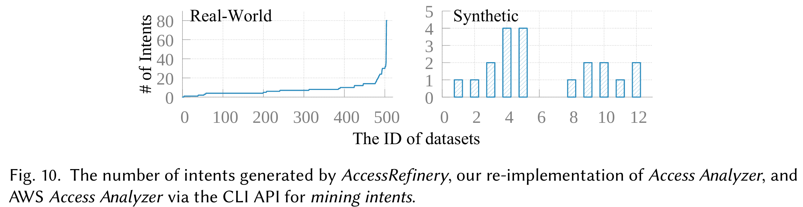

**Running:**

We provide a script to clear previous plotting results and ensure that plotting scripts use data from `results`.

```bash
sh tools/clean_plotting.sh
```

**Expected Output:**

```bash
Clearing paper_figures/data
Clearing paper_figures/results
```

**Running:**

Use the `NumberMCI` values in `accessrefinery_bdd_miner_10rs/Correctness/summary.txt` to generate data of Figure 10 in the paper.

```bash
bash ./tools/figures/extract_correctness_synthetic.sh
```

**Expected Output:**

- `paper_figures/data/Experiment-Correctness-Synthetic.dat`

**Running:**
(Preserve the parentheses when executing the command.)

```shell
(cd paper_figures && gnuplot gnuplot/RQ1-Experiment-Correctness.plt)
```

**Expected Output:**

- `paper_figures/results/RQ1-Experiment-Correctness.pdf`

#### 5. Claim Being Reproduced (Section 6.1):

"*We compared the intents produced by AccessRefinery (without intent reduction), our re-implementation of Access Analyzer, and the AWS Access Analyzer via the CLI API. On synthetic datasets, all three produce the same set of intents.*"

**Running:**

```bash
# Compare AccessRefinery and CLI-based Access Analyzer
sh tools/running_batch_compare.sh

# Compare AccessRefinery and reimplemented Access Analyzer
sh tools/accessanalyzer-reimpl/running_accessanalyzer_compare_with_refinery.sh
```

**Expected Output:**

- `results/`
  - `accessrefinery_miner_compare_results/*.log`
  - `accessanalyzer_miner_compare_results_with_refinery/*.log`

#### 6. Claim Being Reproduced (Section 6.1):

"*(1) The reduced intents fully cover the policy. (2) Removing any intent from the reduced intents causes the remaining intents to no longer cover the policy.*"

**Running:**

```bash
bash ./tools/accessanalyzer-reimpl/check_coverage.sh
```

**Expected Output:**

- `results/coverage_check/`
  - `Correctness/*_coverage.log`
  - `Scalability_05Keys/*_coverage.log`
  - `Scalability_06Keys/*_coverage.log`

#### 7. Target Figure (Section 6.2): Figure 11

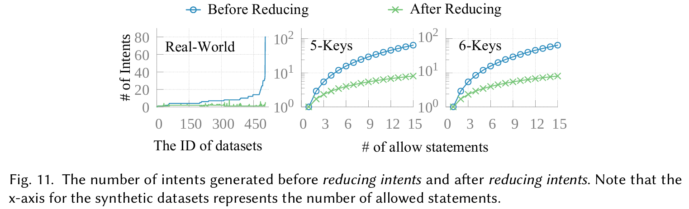

**Running:**

The following command generates data of Figure 11 in the paper from

- `accessrefinery_bdd_reducer_10rs/`
  - `Scalability_05Keys/summary.txt`
  - `Scalability_06Keys/summary.txt`

The `NumberMCI` column represents the number of intents before reduction, and the `NumberRRI` column represents the number after reduction.

```bash
bash tools/figures/extract_effectiveness_synthetic.sh
```

**Expected Output:**

- `paper_figures/data/`
  - `Experiment-Effectiveness-Synthetic-K2.dat`
  - `Experiment-Effectiveness-Synthetic-K3.dat`

**Running:**

```shell
# plot the figure
(cd paper_figures && gnuplot gnuplot/RQ2-Experiment-Effectiveness.plt)
ls paper_figures/results/RQ2*
```

**Expected Output:**

```text
paper_figures/results/RQ2-Experiment-Effectiveness.pdf
```

#### 8. Target Figure (Section 6.3): Figure 12

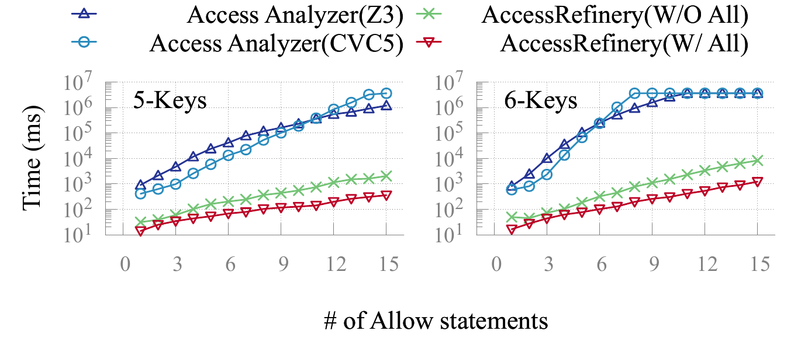

**Running:**

The following command generates data of Figure 12 in the paper from

- `accessrefinery_bdd_miner_10rs/` : `AccessRefinery(W/O All)` in the figure.
  - `Scalability_05Keys/summary.txt` : see `TotalTimeAverage` column
  - `Scalability_06Keys/summary.txt` : see `TotalTimeAverage` column
- `accessrefinery_bdd_reducer_AI_20rs/` : `AccessRefinery(W/ All)` in the figure, the same mining work with all three optimizations on.
  - `Scalability_05Keys/summary.txt` : see `MCILabelsTimeAverage + MCIOperationsTimeAverage` columns (the rest of that summary is reduction, which the figure does not plot)
  - `Scalability_06Keys/summary.txt` : see `MCILabelsTimeAverage + MCIOperationsTimeAverage` columns
- `accessanalyzer_z3_miner_1rs/` : `Access Analyzer(Z3)` in the figure.
  - `Scalability_05Keys/summary.csv` : see `Total Time (s)` column
  - `Scalability_06Keys/summary.csv` : see `Total Time (s)` column
- `accessanalyzer_cvc5_miner_1rs/` : `Access Analyzer(CVC5)` in the figure.
  - `Scalability_05Keys/summary.csv` : see `Total Time (s)` column
  - `Scalability_06Keys/summary.csv` : see `Total Time (s)` column

The `AccessRefinery` columns are milliseconds and the `Access Analyzer` columns are seconds; `extract_scalability_MCI.sh` multiplies the latter by 1000 so that every column of the generated `.dat` is in milliseconds, and clamps anything above `3600000` (one hour) to that value, so a timed-out run is plotted at the limit.

The `AccessRefinery(W/ All)` series comes from the `AI` stage of the four-stage pipeline, whose runs reduce as well as mine. Reduction is the last two columns of that summary (`RRIOperationsTimeAverage` and `RRIILPSolvingTimeAverage`), and `c5 = c6 + c7 + c8 + c9`, so the sum of the two before them (`MCILabelsTimeAverage + MCIOperationsTimeAverage`) is the mining cost this figure compares. `extract_scalability_MCI.sh` writes that reduction to its own single-column `-AI.dat` file rather than appending a column to the `.dat` above, so the existing columns stay as they are.

```bash
bash tools/figures/extract_scalability_MCI.sh
```

**Expected Output:**

- `paper_figures/data/`
  - `Experiment-Scalability-MCI-K2.dat`
  - `Experiment-Scalability-MCI-K3.dat`
  - `Experiment-Scalability-MCI-K2-AI.dat`
  - `Experiment-Scalability-MCI-K3-AI.dat`

**Running:**

```shell
(cd paper_figures && gnuplot gnuplot/RQ3-Experiment-Scalability-Mining.plt)
```

**Expected Output:**

- `paper_figures/results/RQ3-Experiment-Scalability-Mining.pdf`

#### 9. Target Figure (Section 6.3): Figure 13

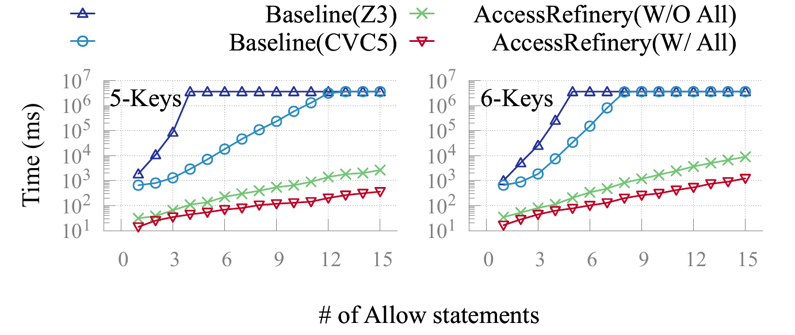

**Running:**

The following command generates data of Figure 13 in the paper from

- `accessrefinery_bdd_reducer_10rs/` : `AccessRefinery(W/O All)` in the figure.
  - `Scalability_05Keys/summary.txt` : see `TotalTimeAverage` column
  - `Scalability_06Keys/summary.txt` : see `TotalTimeAverage` column
- `accessrefinery_bdd_reducer_AI_20rs/` : `AccessRefinery(W/ All)` in the figure, the same reduction work with all three optimizations on.
  - `Scalability_05Keys/summary.txt` : see `TotalTimeAverage` column, which is the whole run (mine plus reduce), the same quantity as the column above
  - `Scalability_06Keys/summary.txt` : see `TotalTimeAverage` column
- `accessanalyzer_z3_reducer_1rs/` : `Access Analyzer(Z3)` in the figure. 
  - `Scalability_05Keys/summary.csv` : see `Total Time (s)` column
  - `Scalability_06Keys/summary.csv` : see `Total Time (s)` column
- `accessanalyzer_cvc5_reducer_1rs/` : `Access Analyzer(CVC5)` in the figure. 
  - `Scalability_05Keys/summary.csv` : see `Total Time (s)` column
  - `Scalability_06Keys/summary.csv` : see `Total Time (s)` column

```bash
bash tools/figures/extract_scalability_RRI.sh
```

**Expected Output:**

- `paper_figures/data/`
  - `Experiment-Scalability-RRI-K2.dat`
  - `Experiment-Scalability-RRI-K3.dat`
  - `Experiment-Scalability-RRI-K2-AI.dat`
  - `Experiment-Scalability-RRI-K3-AI.dat`

**Running:**

```shell
(cd paper_figures && gnuplot gnuplot/RQ3-Experiment-Scalability-Reducing.plt)
```

**Expected Output:**

- `paper_figures/results/RQ3-Experiment-Scalability-Reducing.pdf`

#### 10. Target Figure (Section 6.4): Figure 14

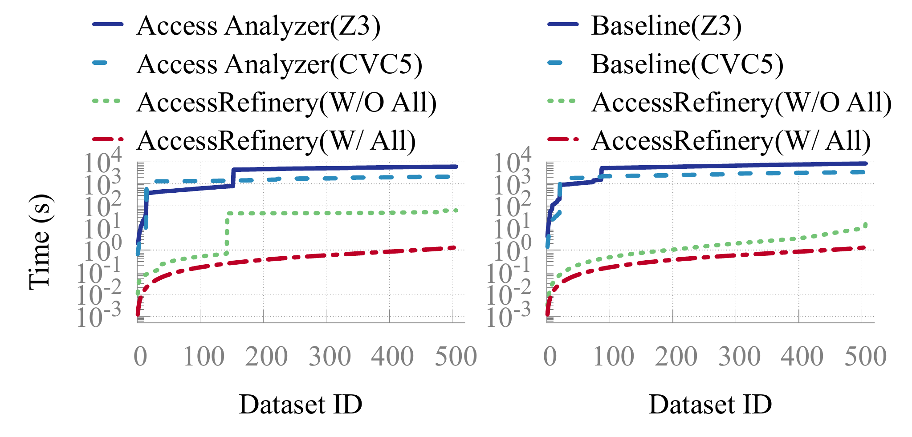

The figure plots four series per panel, over the 506 real-world datasets:

| Series | Left panel (mining) | Right panel (reduction) |
|---|---|---|
| `Access Analyzer(Z3)` | `Experiment-Scalability-MCI-RealWorld.dat` col 1 | `Experiment-Scalability-RRI-RealWorld.dat` col 1 |
| `Access Analyzer(CVC5)` / `Baseline(CVC5)` | col 2 | col 2 |
| `AccessRefinery(W/O All)` | col 4 | col 4 |
| `AccessRefinery(W/ All)` | `Experiment-Scalability-RRI-RealWorld-AI.dat` | same file |

Only the `AccessRefinery(W/ All)` series can be regenerated from the public data: it is the `TotalTimeAverage` column of `accessrefinery_bdd_reducer_AI_20rs/RW/summary.txt`, one row per policy, converted to seconds and sorted ascending — the figure plots cumulative time against datasets ordered cheapest-first, so the order of the column is what the sort establishes. There is no extraction script for the other three columns.

```bash
awk 'NR>1 {printf "%.6f\n", $5 / 1000}' archive_results/accessrefinery_bdd_reducer_AI_20rs/RW/summary.txt \
  | sort -g > paper_figures/archive_data/Experiment-Scalability-RRI-RealWorld-AI.dat
```

The `.dat` files the figure reads all ship in `paper_figures/archive_data/`, and `tools/clean_plotting.sh` copies them into `paper_figures/data/`; run that, or copy the four by hand, before plotting.

**Running:**

```shell
(cd paper_figures && gnuplot gnuplot/RQ4-Experiment-Scalabiliy-RealWorld.plt)
```

**Expected Output:**

- `paper_figures/results/RQ4-Experiment-Scalabiliy-RealWorld.pdf`

#### 11. Claim Being Reproduced (Section 6.5):

"*For intent mining, using JavaBDD is 1-6x faster than using MiniSAT (for clarity, the figure is omitted).*"

**Running:**

The following command generates the data of the mining micro-benchmark from

- `accessrefinery_bdd_miner_10rs/` : time for `JavaBDD` in the paper
  - `Scalability_05Keys/summary.txt` : see `TotalTimeAverage` column
  - `Scalability_06Keys/summary.txt` : see `TotalTimeAverage` column
- `accessrefinery_sat_miner_10rs/` : time for `MiniSAT` in the paper
  - `Scalability_05Keys/summary.txt` : see `TotalTimeAverage` column
  - `Scalability_06Keys/summary.txt` : see `TotalTimeAverage` column

This extraction is shared with Figure 12: `extract_scalability_MCI.sh` writes the `Z3`, `CVC5`, `MiniSAT` and `JavaBDD` columns into the same `Experiment-Scalability-MCI-K2/K3.dat` files, so if Figure 12 has already been reproduced there is nothing left to run here.

```bash
bash tools/figures/extract_scalability_MCI.sh
```

**Expected Output:**

- `paper_figures/data/`
  - `Experiment-Scalability-MCI-K2.dat`
  - `Experiment-Scalability-MCI-K3.dat`
  - `Experiment-Scalability-MCI-K2-AI.dat`
  - `Experiment-Scalability-MCI-K3-AI.dat`

**Running:**

The following command generates the figure omitted in the paper.

```shell
(cd paper_figures && gnuplot gnuplot/RQ5-Experiment-MicroBenchmark-Mining.plt)
```

**Expected Output:**

- `paper_figures/results/RQ5-Experiment-MicroBenchmark-Mining.pdf`

#### 12. Target Figure (Section 6.5): Figure 15

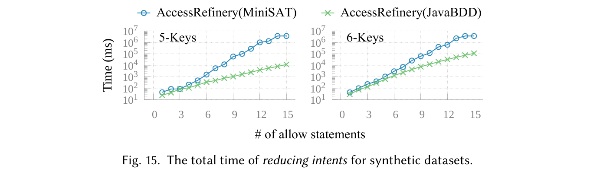

**Running:**

The following command generates data of Figure 15 in the paper from

- `accessrefinery_bdd_reducer_10rs/` time for `JavaBDD` in the paper
  - `Scalability_05Keys/summary.txt` see `TotalTimeAverage` column
  - `Scalability_06Keys/summary.txt` see `TotalTimeAverage` column
- `accessrefinery_sat_reducer_3rs/` time for `MiniSAT` in the paper
  - `Scalability_05Keys/summary.txt` see `TotalTimeAverage` column
  - `Scalability_06Keys/summary.txt` see `TotalTimeAverage` column

> Note: Since SAT-based reduction is much slower, we report SAT results for only 3 rounds. Every `summary.txt` reports `TotalTimeAverage` as the average over the rounds that run actually completed, so comparing that column already compares average time per round — the 3-round SAT run and the 10-round BDD run need no further normalization.

This extraction is shared with Figure 13: `extract_scalability_RRI.sh` writes the `Z3`, `CVC5`, `MiniSAT` and `JavaBDD` columns into the same `Experiment-Scalability-RRI-K2/K3.dat` files, so if Figure 13 has already been reproduced there is nothing left to run here.

```bash
bash tools/figures/extract_scalability_RRI.sh
```

**Expected Output:**

- `paper_figures/data/`
  - `Experiment-Scalability-RRI-K2.dat`
  - `Experiment-Scalability-RRI-K3.dat`
  - `Experiment-Scalability-RRI-K2-AI.dat`
  - `Experiment-Scalability-RRI-K3-AI.dat`

**Running:**

The following command generates Figure 15 in the paper.

```shell
(cd paper_figures && gnuplot gnuplot/RQ5-Experiment-MicroBenchmark-Reducing.plt)
```

**Expected Output:**

- `paper_figures/results/RQ5-Experiment-MicroBenchmark-Reducing.pdf`

#### 13. Target Table (Section 6.6): Table 2

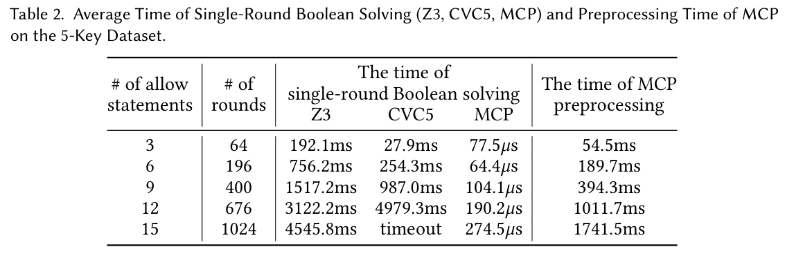

**Required logs**:

- `accessrefinery_bdd_miner_10rs/`
  - `Scalability_05Keys/summary.txt`

The `MCISolvingRoundAverage` column in `summary.txt` file is the number of SMT solving rounds in the table. The `MCILabelsTimeAverage` column is the average MCP preprocessing time in the table. `MCIOperationsTimeAverage / MCISolvingRoundAverage` is the single-round Boolean solving time in the table. The `NumberMCI` column is the number of mined intents, reported as the `# intents` column of the generated table; `NumberRRI` (the number of reduced intents) is not used by `tools/figures/generate_table.sh`.

- `accessanalyzer_z3_miner_1rs/`
  - `Scalability_05Keys/summary.csv`
- `accessanalyzer_cvc5_miner_1rs/`
  - `Scalability_05Keys/summary.csv`

The `Average Time per Round (s)` column in `summary.csv` file is the average single-round SMT solving time in the table for `Z3` and `CVC5`.

The table is generated by LaTeX. Therefore, no plotting program is used.

#### 14. Target Figure (Section 6.7): Figure 16

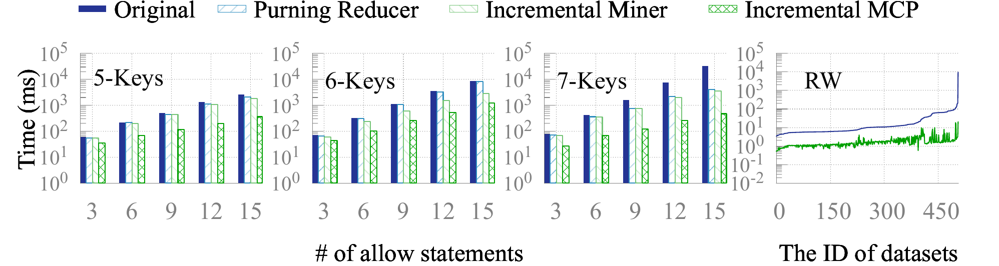

**Required logs**:

`results/` must hold the four stage folders of the optimization pipeline, each with its own `summary.txt` per dataset — the extraction script reads them there. If `results/` does not have them yet, populate it from the archive rather than re-running the pipeline:

```shell
mkdir -p results/
for stage in "" _AR _AM _AI; do
  cp -r archive_results/accessrefinery_bdd_reducer${stage}_20rs results/
done
```

- `results/accessrefinery_bdd_reducer_20rs/` — `BR`, the pipeline with all three optimizations off.
- `results/accessrefinery_bdd_reducer_AR_20rs/` — `AR`, `BR` plus the reducer's essential-finding pre-filter.
- `results/accessrefinery_bdd_reducer_AM_20rs/` — `AM`, `AR` plus the miner's BFS early-exit and refinement DAG.
- `results/accessrefinery_bdd_reducer_AI_20rs/` — `AI`, `AM` plus the incremental EC engine (all defaults).

All four are produced by `tools/accessrefinery/running_bdd_reducer_20rs.sh`, whose three cumulative switches are described in [README](README.md#optimization-pipeline). This figure compares the per-policy total execution time, `TotalTimeAverage` (column 5).

**Running:**

```bash
bash tools/figures/extract_optimization_pipeline.sh
```

This one script regenerates the data of all four optimization-pipeline figures (Figures 16-19) into `paper_figures/data/`; each of the four sections below only differs in which of those files it plots, so if it has already been run there is nothing left to run in the other three.

**Expected Output:**

- `paper_figures/data/p_bar_ix_05.dat`, `p_bar_ix_06.dat`, `p_bar_ix_07.dat`
  Header `idx BR AR AM AI`: column 5 of all four stages for the five policies of each Scalability dataset that have 3, 6, 9, 12 and 15 statements — i.e. summary rows 3, 6, 9, 12 and 15, the same rows tabulated by Table 2.
- `paper_figures/data/rw_br_ai.dat`
  Header `Policy BR AI`: on `RW`, column 5 of `BR` against column 6 (`MCILabelsTimeAverage`) of `AI`.

In every `RW` file the rows are sorted by the file's first data column ascending and numbered 0 to 505, and both columns of a row come from the same policy. The sort key is the computed value rather than its two-decimal rendering in `summary.txt`: two policies whose values both print as, say, `1.32` are still ordered by their exact sums, so the row order does not depend on the rounding of the report.

**Running:**

```shell
(cd paper_figures && gnuplot gnuplot/Optimization-Overview-Bars.plt)
```

**Expected Output:**

- `paper_figures/results/Optimization-Overview-Bars.pdf`

#### 15. Target Figure (Section 6.7): Figure 17

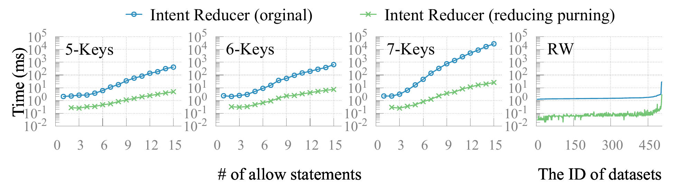

**Running:**

This figure isolates the intent reducer: columns 8 and 9 (`RRIOperationsTimeAverage + RRIILPSolvingTimeAverage`, the set-cover cost over the candidates) of `BR` against the same two columns of `AR`.

```bash
bash tools/figures/extract_optimization_pipeline.sh
```

**Expected Output:**

- `paper_figures/data/p1_05.dat`, `p6_br_ar.dat`, `p1_07.dat`
  Header `Policy A B`: `BR` and `AR` for `Scalability_05Keys`, `06Keys` and `07Keys` respectively, in `summary.txt` row order, policies numbered 1 to 15. (The 6-key file is named `p6_br_ar.dat` rather than `p1_06.dat`.)
- `paper_figures/data/rw_p1.dat`
  Header `Policy A B`: the same two columns on `RW`, sorted by column A ascending and numbered 0 to 505.

**Running:**

```shell
(cd paper_figures && gnuplot gnuplot/RQ7-ReducingPruning-BR-AR.plt)
```

**Expected Output:**

- `paper_figures/results/RQ7-ReducingPruning-BR-AR.pdf`

#### 16. Target Figure (Section 6.7): Figure 18

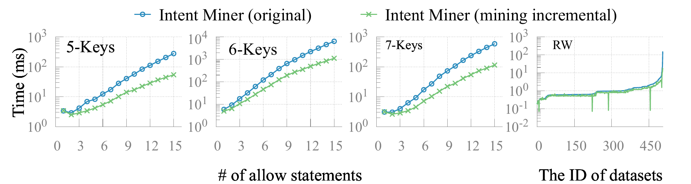

**Running:**

This figure isolates the intent miner: column 7 (`MCIOperationsTimeAverage`, the node-computation cost) of `AR` against `AM`.

```bash
bash tools/figures/extract_optimization_pipeline.sh
```

**Expected Output:**

- `paper_figures/data/p2_05.dat`, `p2_06.dat`, `p2_07.dat`
  Header `Policy A B`: `AR` and `AM` for `Scalability_05Keys`, `06Keys` and `07Keys`, in `summary.txt` row order, policies numbered 1 to 15.
- `paper_figures/data/rw_p2.dat`
  Header `Policy A B`: the same two columns on `RW`, sorted by column A ascending and numbered 0 to 505.

**Running:**

```shell
(cd paper_figures && gnuplot gnuplot/RQ8-MiningPruning-AR-AM.plt)
```

**Expected Output:**

- `paper_figures/results/RQ8-MiningPruning-AR-AM.pdf`

#### 17. Target Figure (Section 6.7): Figure 19

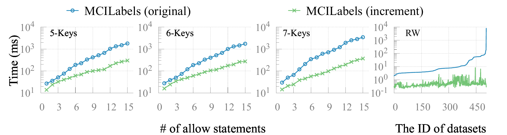

**Running:**

This figure isolates the EC engine: column 6 (`MCILabelsTimeAverage`) of `AM` against `AI`. The `RW` panel is the archive of the measurement described in claim 18 below.

```bash
bash tools/figures/extract_optimization_pipeline.sh
```

**Expected Output:**

- `paper_figures/data/p3_05.dat`, `p3_06.dat`, `p3_07.dat`
  Header `Policy A B`: `AM` and `AI` for `Scalability_05Keys`, `06Keys` and `07Keys`, in `summary.txt` row order, policies numbered 1 to 15.
- `paper_figures/data/rw_p3.dat`
  Header `Policy A B`: the same two columns on `RW`, sorted by column A ascending and numbered 0 to 505.

**Running:**

```shell
(cd paper_figures && gnuplot gnuplot/RQ9-Incremental-AM-AI.plt)
```

**Expected Output:**

- `paper_figures/results/RQ9-Incremental-AM-AI.pdf`

#### 18. Claim Being Reproduced (Section 6.7):

"*On the RW dataset we compare full and incremental handling of one newly added label, given that the original data has already been processed.*"

**Setup:**

The experiment compares the two ways of absorbing a newly added label, given that the policy has already been processed:

- the **full** path (`AM` stage, `-Dopt.ai=false`): the EC partition is recomputed over the policy's entire label set;
- the **incremental** path (`AI` stage, the default): the new label is added on top of the already processed data, and only the ECs the new label can belong to are touched.

The compared quantity is the `MCILabelsTimeAverage` column of `results/accessrefinery_bdd_reducer_AM_20rs/RW/summary.txt` against the same column of `results/accessrefinery_bdd_reducer_AI_20rs/RW/summary.txt`; both summaries are public, and each row is the average over the 20 rounds of `--round 20`. Averaged over the 506 policies, the full path costs **32.54 ms** per policy against **1.46 ms** incremental, a **95.5%** reduction.

The runs themselves read `data/RW/`, which is not public, so the experiment cannot be re-executed here — only the two summaries it produced can be inspected.