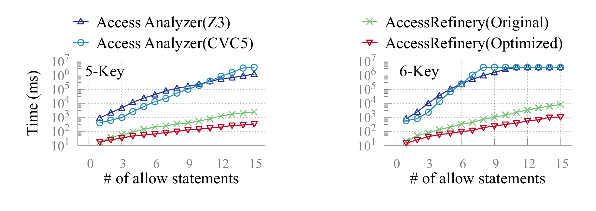
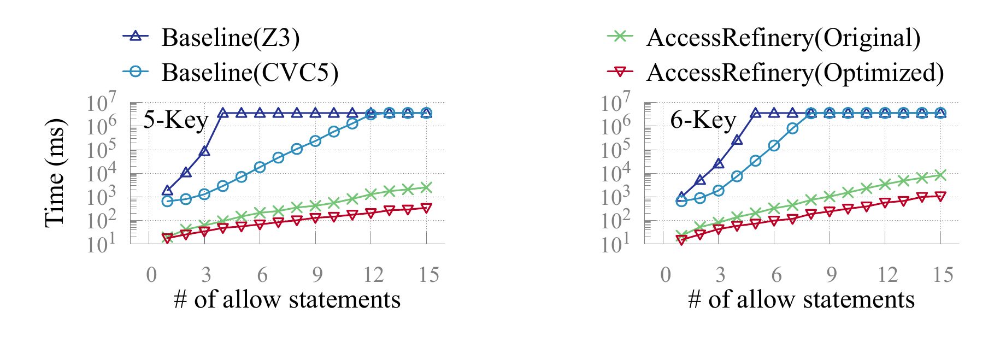
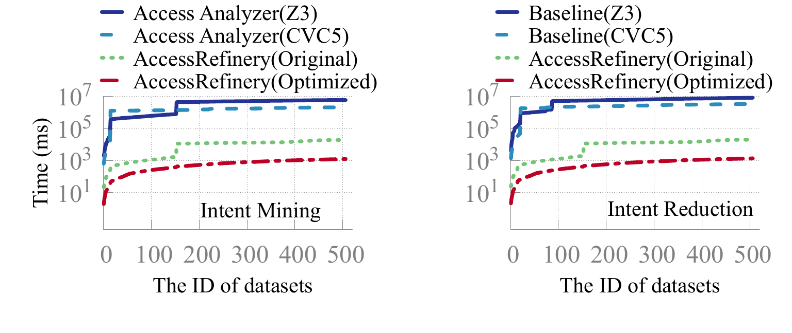
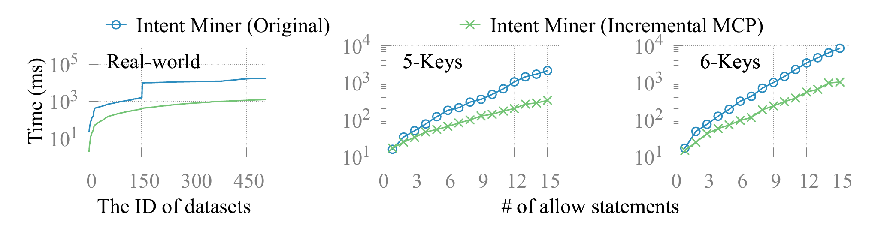
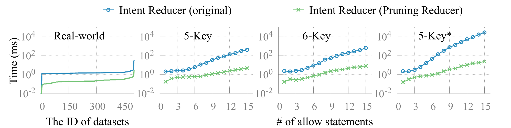
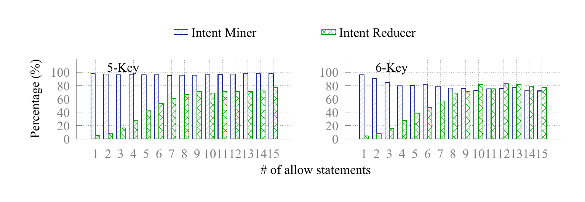

### Verifying Claims in the Paper

After generating `results/`, we explain how to reproduce the figures and conclusions reported in the paper.

This document covers the extension experiment of this revision: the redraws of the scalability figures (RQ3 and RQ4, Figures 14-16) and the three-stage optimization pipeline **Original → Pruning Reducer → Incremental MCP** (RQ7 and RQ8, Figures 18-20). Its material is kept in its own directories: archived outputs in `archive_results_journal/`, plotting inputs in `paper_figures_journal/data/`, `.plt` files in `paper_figures_journal/gnuplot/`, rendered PDFs in `paper_figures_journal/results/`.

> **Note on numbering.** §1-§13 of the original document reproduce the experiments reported in the original submission — RQ1-RQ6, plus the two claims the paper makes in its setup section (§6), the AWS CLI time-out and the identical intents of the two *Access Analyzer* versions. Those experiments are not part of this repository: the conference-version `archive_results/`, `paper_figures/` and the real-world `data/RW/` are not shipped, so those sections are not included here. The section numbers below are kept continuous with the original document, so the extension experiment keeps its §14-§18 numbering.

`results/` is the working directory that the experiment scripts write to and that the extraction scripts read from. `archive_results_journal/` holds the immutable results shipped with this artifact, so every dataset below can either be run or skipped by copying the corresponding archive folder into `results/`.

Each section from §14 on is labelled with the research question it answers: RQ3, RQ4, RQ7 and RQ8.

> **Note:** the real-world `RW` corpus is not public, for commercial reasons. The 506 raw policies of `data/RW/` are not released, so the runs that read them cannot be re-executed from this artifact, and the extraction script leaves the real-world plotting data it ships with in place.

#### Setup Common to §§14-18

The *Access Analyzer* baselines Figures 14-16 compare against come from the conference-version archive, which is not part of this repository (see [README-FSE26.md](README-FSE26.md)); the optimization pipeline itself is run by one script, whose stages are selected on the command line — no stage flag is *Original*, `-p` is *Pruning Reducer*, `-o` is *MiningOptimized* and `-p -i` is *Incremental MCP*. Copying the shipped archive is the alternative to running it, which takes about 110 minutes:

```shell
mkdir -p results/
# Access Analyzer with the CVC5 and Z3 backends, AccessRefinery with the MiniSAT and BDD backends
cp -r archive_results/accessanalyzer_*rs results/
cp -r archive_results/accessrefinery_sat_*rs results/
cp -r archive_results/accessrefinery_bdd_*rs results/

# skip the runs of this revision by reusing its archive instead
cp -r archive_results_journal/accessrefinery_bdd_reducer_*rs results/

# or run the pipeline itself
bash tools/accessrefinery/running_optimization_pipeline.sh
```

Every run writes `results/accessrefinery_bdd_reducer_{Original,PruningReducer,IncrementalMCP,MiningOptimized}_{10,20}rs/`, each holding one `summary.txt` per dataset, `Scalability_05Keys` and `Scalability_06Keys`, reporting the average over the run's rounds. The columns a figure reads are named by its section below.

Before plotting, clear previously rendered PDFs so that every figure is regenerated rather than reused:

```shell
sh tools/clean_plotting.sh
```

Then extract the plotting data. One script does all of it, and it **overwrites** what it writes into `paper_figures_journal/data/`: the six figure files of Figures 18-20 whole, and the files of Figures 14-15 in place. A missing source is reported on stderr and never filled with a placeholder: the files of Figures 18-20 then come out empty, and a column of Figures 14-15 keeps the value the shipped file already has.

```shell
bash tools/figures/extract_optimization_pipeline.sh
```

To draw the whole set in one go, from the repository root:

```shell
bash paper_figures_journal/draw.sh
```

#### 14. Scalability of Intent Mining and Reduction (RQ3): Figures 14 and 15




**Required logs**: `results/accessrefinery_bdd_reducer_Original_10rs/` and `results/accessrefinery_bdd_reducer_IncrementalMCP_10rs/`, each with a `summary.txt` for `Scalability_05Keys` and `Scalability_06Keys` — the two stages these figures compare; the archive-copy step above populates both. The *Access Analyzer* curves are read from `results/accessanalyzer_z3_miner_1rs/` and `results/accessanalyzer_z3_reducer_1rs/`, from the conference-version archive.

**Expected Output:** two data files per figure, one per dataset size, K2 being `Scalability_05Keys` and K3 `Scalability_06Keys`. The script rewrites the *Access Analyzer* (Z3) and *AccessRefinery* (Original) columns of each; the CVC5 and MiniSAT columns belong to the conference-version figures and are kept as shipped.

- `paper_figures_journal/data/Experiment-Scalability-MCI-K2.dat`, `-K3.dat` — Figure 14, columns `idx Access Analyzer(Z3) Access Analyzer(CVC5) MiniSAT AccessRefinery(Original)`, one row per policy and `idx` counting 1 to 15. Column 2 is the baseline's mining time, from column 5 of that dataset's `summary.csv` (`Total Time (s)`, to milliseconds, a policy the baseline does not finish taking the 3600000 ms timeout sentinel); column 5 is the *Original* stage's mining cost, `MCILabelsTimeAverage + MCIOperationsTimeAverage` (columns 6+7).
- `paper_figures_journal/data/Experiment-Scalability-MCI-K2-WAll.dat`, `-K3-WAll.dat` — the *AccessRefinery* (Optimized) curve of Figure 14: the *Incremental MCP* stage's mining cost, columns 6+7 of the same two summary files.
- `paper_figures_journal/data/Experiment-Scalability-RRI-K2.dat`, `-K3.dat` — Figure 15, columns `Access Analyzer(Z3) Access Analyzer(CVC5) MiniSAT AccessRefinery(Original)`, one row per policy and no index column. Column 1 is the baseline's reduction time, from column 5 of that dataset's `summary.csv` (`Total Time (s)`, to milliseconds); column 4 is the *Original* stage's per-policy total execution time, `TotalTimeAverage` (column 5).
- `paper_figures_journal/data/Experiment-Scalability-RRI-K2-WAll.dat`, `-K3-WAll.dat` — the *AccessRefinery* (Optimized) curve of Figure 15: the *Incremental MCP* stage's `TotalTimeAverage`.

**Running:**

```shell
(cd paper_figures_journal && gnuplot gnuplot/RQ3-Experiment-Scalability-Mining.plt)
(cd paper_figures_journal && gnuplot gnuplot/RQ3-Experiment-Scalability-Reducing.plt)
```

**Expected Output:**

- `paper_figures_journal/results/RQ3-Experiment-Scalability-Mining.pdf`
- `paper_figures_journal/results/RQ3-Experiment-Scalability-Reducing.pdf`

#### 15. Real-World Scalability (RQ4): Figure 16



**Required logs**: none. The figure reads `paper_figures_journal/data/Experiment-Scalability-{MCI,RRI}-RealWorld.dat` and their `-WAll.dat` companions, four files that ship with the artifact and that no script of this repository regenerates: they were extracted from the per-stage `RW/summary.txt` of the conference-version archive, which is withheld together with the corpus. Figure 16 can therefore be redrawn here, but its data cannot be recomputed.

**Running:**

```shell
(cd paper_figures_journal && gnuplot gnuplot/RQ4-Experiment-Scalabiliy-RealWorld.plt)
```

(The script and its `set output` both spell the name *Scalabiliy*, so the typo is consistent and the file below is what it writes.)

**Expected Output:**

- `paper_figures_journal/results/RQ4-Experiment-Scalabiliy-RealWorld.pdf`

#### 16. Intent Reduction with Pruning (RQ7): Figure 18



**Required logs**: `results/accessrefinery_bdd_reducer_Original_20rs/` and `results/accessrefinery_bdd_reducer_PruningReducer_20rs/`, each with a `summary.txt` for `Scalability_05Keys` and `Scalability_06Keys`.

This figure isolates the intent reducer: columns 8 and 9 (`RRIOperationsTimeAverage + RRIILPSolvingTimeAverage`, the set-cover cost over the candidates) of the *Original* stage against the same two columns of *Pruning Reducer*.

**Expected Output:**

- `paper_figures_journal/data/p1_05.dat`, `p1_06.dat`
  Header `Policy A B`: the *Original* and *Pruning Reducer* stages for `Scalability_05Keys` and `Scalability_06Keys` respectively, in `summary.txt` row order, the 15 policies numbered 1 to 15.
- `paper_figures_journal/data/rw_p1.dat` — the real-world panel. It is **not** rewritten: its two summaries are withheld like the corpus itself, so the archived file is left in place and the figure keeps reading it. The script reports the skip.

**Running:**

```shell
(cd paper_figures_journal && gnuplot gnuplot/RQ7-ReducingPruning-Original-PruningReducer.plt)
```

**Expected Output:**

- `paper_figures_journal/results/RQ7-ReducingPruning-Original-PruningReducer.pdf`

#### 17. Intent Mining with Pruning and Incremental MCP (RQ7): Figure 19



**Required logs**: `results/accessrefinery_bdd_reducer_PruningReducer_10rs/` and `results/accessrefinery_bdd_reducer_IncrementalMCP_10rs/`, each with a `summary.txt` for `Scalability_05Keys` and `Scalability_06Keys`.

This figure isolates the intent miner: columns 6 and 7 (`MCILabelsTimeAverage + MCIOperationsTimeAverage`, the label update and the refinement-DAG node construction) of *Pruning Reducer* against the same two columns of *Incremental MCP*. The panel titles the first curve *Intent Miner (Original)*; its values are the *Pruning Reducer* stage's.

**Expected Output:**

- `paper_figures_journal/data/p2_05.dat`, `p2_06.dat`
  Header `Policy A B`: the *Pruning Reducer* and *Incremental MCP* stages for `Scalability_05Keys` and `Scalability_06Keys`, in `summary.txt` row order, the 15 policies numbered 1 to 15.
- `paper_figures_journal/data/rw_p2.dat` — the real-world panel, not rewritten, as in §16.

**Running:**

```shell
(cd paper_figures_journal && gnuplot gnuplot/RQ7-MiningPruning-PruningReducer-IncrementalMCP.plt)
```

**Expected Output:**

- `paper_figures_journal/results/RQ7-MiningPruning-PruningReducer-IncrementalMCP.pdf`

#### 18. Optimization Overview (RQ8): Figure 20



**Required logs**: `results/accessrefinery_bdd_reducer_MiningOptimized_10rs/`, with a `summary.txt` for `Scalability_05Keys` and `Scalability_06Keys`. This is the mining-phase search optimization alone, `-o` on the command line, which is not one of the three pipeline stages. It is optional: without that folder the script reports it and the two files below come out empty, while everything else in §§14-17 still reproduces.

This figure reports how much of each phase's window goes to the encoding side. Its two shares are read from that configuration's own `summary.txt`: the intent miner's share is `100*c6/(c6+c7)`, its window up to the end of the label tree, and the intent reducer's is `100*c8/(c8+c9)`, its window up to the end of the EC encoding of the findings.

**Expected Output:**

- `paper_figures_journal/data/enc_05.dat`, `enc_06.dat`
  Header `idx Miner Reducer`: the two shares, in percent, for `Scalability_05Keys` and `Scalability_06Keys`, one row per policy of the dataset numbered 0 to 14.

**Running:**

```shell
(cd paper_figures_journal && gnuplot gnuplot/RQ8-Optimization-Overview-Bars-Percentage.plt)
```

**Expected Output:**

- `paper_figures_journal/results/RQ8-Optimization-Overview-Bars-Percentage.pdf`

#### Claim Not Reproduced (RQ8)

"*On the RW dataset we compare full and incremental handling of one newly added label, given that the original data has already been processed.*"

The real-world `RW` data this claim reports on is not public, for commercial reasons, so this claim is not reproduced here.
