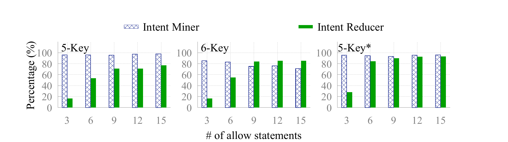

### Verifying Claims in the Paper

After generating `results/`, we explain how to reproduce the figures and conclusions reported in the paper.

This document covers the extension experiment of this revision: the **Original → Pruning Reducer → Incremental MCP optimization pipeline**, which answers RQ7-RQ9. Its material is kept in its own directories: archived outputs in `archive_results_journal/`, plotting inputs in `paper_figures/archive_data_journal/`, `.plt` files in `paper_figures/gnuplot_journal/`, rendered PDFs in `paper_figures/results_journal/`.

> **Note on numbering.** §1-§13 of the original document reproduce the experiments reported in the original submission — RQ1-RQ6, plus the two claims the paper makes in its setup section (§6), the AWS CLI time-out and the identical intents of the two *Access Analyzer* versions. Those experiments are not part of this repository: `archive_results/`, `paper_figures/gnuplot/`, `paper_figures/archive_data/`, `paper_figures/results/`, `baselines/` and `data/RW/` are not shipped, so those sections are not included here. The section numbers below are kept continuous with the original document, so the extension experiment keeps its §14-§18 numbering.

`results/` is the working directory that the experiment scripts write to and that the extraction scripts read from.

Each section from §14 on is labelled with the research question it answers: RQ7-RQ9 for the extension experiment.

> **Note:** the real-world `RW` corpus is not public, for commercial reasons. The 506 raw policies of `data/RW/` are not released, so the runs that read them cannot be re-executed from this artifact.

#### 14. Target Figure (RQ7): Figure 18

> ## Extension Experiment: §14-§18
>
> Sections 14 to 18 reproduce the extension experiment of this revision: the **Original → Pruning Reducer → Incremental MCP optimization pipeline**, whose three stages isolate one optimization each. They read `archive_results_journal/`, `paper_figures/gnuplot_journal/`, `paper_figures/archive_data_journal/` and `paper_figures/results_journal/`; no other material is needed.
>
> The real-world `RW` corpus is not public, for commercial reasons, so this reproduction covers the `05Keys`, `06Keys` and `05Keys∗` datasets.
>
> Before plotting, run `sh tools/clean_plotting.sh` to clear previously rendered PDFs, so that every figure below is regenerated rather than reused. It clears `paper_figures/results_journal/` only; the plotting inputs under `paper_figures/` are never touched.
>
> Figures 18-20 each carry a fourth, real-world panel besides the three synthetic ones. Those panels are read from the plotting data that ships in `paper_figures/archive_data_journal/` (`rw_p1.dat` at the top level, and `rw_bar3.dat` and `rw_p2.dat` under `10rs/`). The per-stage `RW/summary.txt` they were extracted from are not public, for commercial reasons, like the corpus itself, so those panels are not recomputed: the extraction scripts skip them and leave the archived `.dat` in place.


**Required logs**:

`results/accessrefinery_bdd_reducer_{Original,PruningReducer,IncrementalMCP}_10rs/` must hold the three stage folders of the 10-round run, each with its own `summary.txt` per dataset — the extraction script reads them there. If `results/` does not have them yet, populate it from the archive rather than re-running the pipeline:

```shell
mkdir -p results/
for stage in _Original _PruningReducer _IncrementalMCP; do
  cp -r archive_results_journal/accessrefinery_bdd_reducer${stage}_10rs results/
done
```

- `results/accessrefinery_bdd_reducer_Original_10rs/` — **Original**, the pipeline with all three optimizations off.
- `results/accessrefinery_bdd_reducer_PruningReducer_10rs/` — **Pruning Reducer**, Original plus the reducer's essential-finding pre-filter.
- `results/accessrefinery_bdd_reducer_IncrementalMCP_10rs/` — **Incremental MCP**, Pruning Reducer plus the miner's refinement-DAG node construction, BFS early-exit and the incremental EC engine (all defaults).

All three hold the same three configurations as `tools/accessrefinery/running_bdd_reducer_20rs.sh`, whose cumulative switches are described in [README](README.md#optimization-pipeline), but were run with `--round 10`; no script in this artifact re-runs them at 10 rounds, so populate `results/` from `archive_results_journal/` as above. This figure compares the per-policy total execution time, `TotalTimeAverage` (column 5).

**Running:**

```bash
bash tools/figures/extract_optimization_pipeline_10rs.sh
```

This one script regenerates the plotting data of the three figures that read the 10-round stage folders (Figures 18, 20 and 21) into `paper_figures/archive_data_journal/10rs/`; §15 runs `tools/figures/extract_optimization_pipeline.sh` instead, which regenerates Figure 19 from the 20-round archive under `results/`.

**Expected Output:**

- `paper_figures/archive_data_journal/10rs/bar3_05.dat`, `bar3_06.dat`, `bar3_07.dat`
  Header `idx Original PruningReducer IncrementalMCP`: column 5 of all three stages for the five policies of each Scalability dataset that have 3, 6, 9, 12 and 15 statements — i.e. summary rows 3, 6, 9, 12 and 15, the same five rows the paper's Table 2 tabulates.
- `paper_figures/archive_data_journal/10rs/rw_bar3.dat` — the `RW` panel. This one is **not** rewritten: its W/O All curve needs the real-world baseline's per-phase columns, which are withheld, so the archived file is left in place and the figure keeps reading it.

**Running:**

```shell
(cd paper_figures && gnuplot gnuplot_journal/RQ7-Optimization-Overview-Bars-3Stage.plt)
```

**Expected Output:**

- `paper_figures/results_journal/RQ7-Optimization-Overview-Bars-3Stage.pdf`

The earlier rendering of this figure, `Optimization-Overview-Bars.pdf`, took its three stages from the 20-round archive instead (`paper_figures/archive_data_journal/p_bar_ix_05/06/07.dat` and `rw_bar_ix.dat`, produced by `tools/figures/extract_optimization_pipeline.sh` from `results/accessrefinery_bdd_reducer_*_20rs/`). It is not shipped in this revision; those files stay checked in for the record.

#### 15. Target Figure (RQ8): Figure 19


**Required logs**:

`results/` must hold the three stage folders of the 20-round run, each with its own `summary.txt` per dataset — the extraction script reads them there. If `results/` does not have them yet, populate it from the archive rather than re-running the pipeline:

```shell
mkdir -p results/
for stage in _Original _PruningReducer _IncrementalMCP; do
  cp -r archive_results_journal/accessrefinery_bdd_reducer${stage}_20rs results/
done
```

- `results/accessrefinery_bdd_reducer_Original_20rs/` — **Original**, the pipeline with all three optimizations off.
- `results/accessrefinery_bdd_reducer_PruningReducer_20rs/` — **Pruning Reducer**, Original plus the reducer's essential-finding pre-filter.
- `results/accessrefinery_bdd_reducer_IncrementalMCP_20rs/` — **Incremental MCP**, Pruning Reducer plus the miner's refinement-DAG node construction, BFS early-exit and the incremental EC engine (all defaults).

**Running:**

This figure isolates the intent reducer: columns 8 and 9 (`RRIOperationsTimeAverage + RRIILPSolvingTimeAverage`, the set-cover cost over the candidates) of the Original stage against the same two columns of Pruning Reducer.

```bash
bash tools/figures/extract_optimization_pipeline.sh
```

**Expected Output:**

- `paper_figures/archive_data_journal/p1_05.dat`, `p1_06.dat`, `p1_07.dat`
  Header `Policy A B`: the Original and Pruning Reducer stages for `Scalability_05Keys`, `06Keys` and `05Keys∗` respectively, in `summary.txt` row order, policies numbered 1 to 15.

**Running:**

```shell
(cd paper_figures && gnuplot gnuplot_journal/RQ8-ReducingPruning-Original-PruningReducer.plt)
```

**Expected Output:**

- `paper_figures/results_journal/RQ8-ReducingPruning-Original-PruningReducer.pdf`

#### 16. Target Figure (RQ8): Figure 20


**Running:**

This figure isolates the intent miner: the mining cost of the Pruning Reducer stage against the Incremental MCP stage, i.e. columns 6 and 7 (`MCILabelsTimeAverage + MCIOperationsTimeAverage`, the label update and the node computation, with the reducer's two columns taken out) of the two. Like §14 it reads the 10-round runs, whose stage folders ship with this artifact, so the archive-copy loop of §15 does not apply.

```bash
bash tools/figures/extract_optimization_pipeline_10rs.sh
```

**Expected Output:**

- `paper_figures/archive_data_journal/10rs/p2_05.dat`, `p2_06.dat`, `p2_07.dat`
  Header `Policy A B`: Pruning Reducer and Incremental MCP for `Scalability_05Keys`, `06Keys` and `05Keys∗`, in `summary.txt` row order, policies numbered 1 to 15.
- `paper_figures/archive_data_journal/10rs/rw_p2.dat` — the `RW` panel, written only when the withheld real-world summaries are present.

**Running:**

```shell
(cd paper_figures && gnuplot gnuplot_journal/RQ8-MiningPruning-PruningReducer-IncrementalMCP.plt)
```

**Expected Output:**

- `paper_figures/results_journal/RQ8-MiningPruning-PruningReducer-IncrementalMCP.pdf`

#### 17. Target Figure (RQ9): Figure 21



**Running:**

This figure reports how much of each phase's window goes to the encoding side, on the `MiningOptimized` configuration — the mining phase's search optimization alone, `-Dopt.pruner=false -Dopt.refinement=true -Dopt.incremental=false`, which is not one of the three pipeline stages. Its two shares are read from that configuration's own `summary.txt`: the intent miner's share is `100*c6/(c6+c7)`, its window up to the end of the label tree, and the intent reducer's is `100*c8/(c8+c9)`, its window up to the end of the EC encoding of the findings. The configuration is optional: without `results/accessrefinery_bdd_reducer_MiningOptimized_10rs/`, the script skips this figure's data and everything else in §14-§17 still reproduces.

```bash
bash tools/figures/extract_optimization_pipeline_10rs.sh
```

**Expected Output:**

- `paper_figures/archive_data_journal/10rs/enc_05.dat`, `enc_06.dat`, `enc_07.dat`
  Header `idx Miner Reducer`: the two shares, in percent, for the policies of 3, 6, 9, 12 and 15 statements, numbered 0 to 4.
- `paper_figures/archive_data_journal/10rs/rw_enc.dat` — the same two shares over the withheld real-world policies, written only when `results/accessrefinery_bdd_reducer_MiningOptimized_10rs/RW/` is present; no figure of this artifact reads it, the paper's Figure 21 having no real-world panel.

**Running:**

```shell
(cd paper_figures && gnuplot gnuplot_journal/RQ9-Optimization-Overview-Bars-Percentage.plt)
```

**Expected Output:**

- `paper_figures/results_journal/RQ9-Optimization-Overview-Bars-Percentage.pdf`

#### 18. Claim Being Reproduced (RQ9):

"*On the RW dataset we compare full and incremental handling of one newly added label, given that the original data has already been processed.*"

The real-world `RW` data this claim reports on is not public, for commercial reasons, so this claim is not reproduced here.
